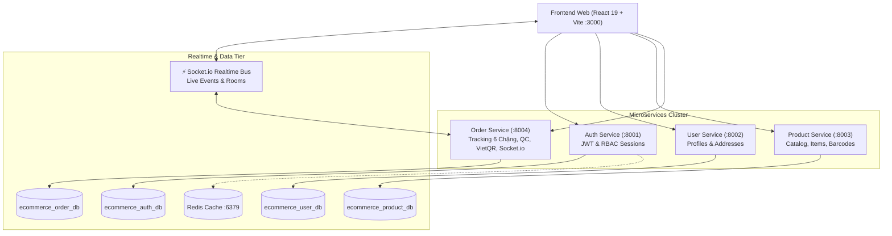
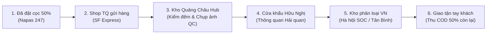

# Hệ Thống Quản Lý Bán Hàng & Đơn Hàng Mua Hộ Quốc Tế (OmniOrder)

> **OmniOrder** là nền tảng thương mại điện tử chuyên biệt cho **Mô hình Order Mua hộ Hàng Nội Địa Trung Quốc (Taobao / 1688 / Tmall) về Việt Nam (7 - 14 ngày)**, được kiến trúc theo chuẩn **Microservices**, cơ sở dữ liệu phân tán PostgreSQL riêng biệt cho từng service, cache Redis và WebSocket thời gian thực (Socket.io).

---

## 🏛️ 1. Kiến Trúc Hệ Thống (Microservices Architecture)

Toàn bộ hệ thống được chia nhỏ thành các dịch vụ độc lập theo nguyên lý **Database-per-Service**:



### Chi tiết các dịch vụ:
| Dịch vụ | Cổng | Cơ sở dữ liệu | Nhiệm vụ chính |
| :--- | :---: | :--- | :--- |
| **`auth-service`** | `:8001` | `ecommerce_auth_db` | Xác thực người dùng, ký JWT token, phân quyền (Admin, Manager, Customer), lưu session Redis. |
| **`user-service`** | `:8002` | `ecommerce_user_db` | Quản lý hồ sơ cá nhân, số điện thoại, trạng thái tài khoản và sổ địa chỉ nhận hàng tại Việt Nam. |
| **`product-service`** | `:8003` | `ecommerce_product_db` | Quản trị catalog sản phẩm, biến thể Items/SKU, hệ thống mã tra cứu (Code, SKU, Barcode, QR). |
| **`order-service`** | `:8004` | `ecommerce_order_db` | Quản lý đơn hàng mua hộ, theo dõi 6 mốc lộ trình, ảnh kiểm hàng QC, đối soát cọc 50%, Socket.io real-time. |
| **`frontend`** | `:3000` | *N/A (Client)* | Giao diện React 19, Tailwind CSS v4, chuyển đổi 6 phân hệ, in phiếu vận đơn song ngữ, live sync. |

---

## 🇨🇳 2. Mô Hình Nghiệp Vụ: Đặt Hàng Trung Quốc (7 - 14 Ngày)

### 2.1. Cơ chế Tài chính (Cọc 50% & COD 50%)
1. **Đặt cọc 50% (Deposit)**: Khi đặt hàng, khách hàng thanh toán trước 50% giá trị đơn hàng thông qua mã chuyển khoản nhanh **VietQR Napas 247** để xác nhận mua hàng và đại lý tiến hành đặt hãng tại Trung Quốc.
2. **Thu hộ 50% còn lại (COD)**: 50% số tiền còn lại sẽ được nhân viên bưu chính thu tiền mặt khi giao kiện hàng tận tay người nhận tại Việt Nam.

### 2.2. Lộ trình 6 Chặng Logistics Xuyên Biên Giới


- **Trạm 1 (`ORDER_DEPOSITED`)**: Đã thanh toán đặt cọc 50% thành công qua VietQR, hệ thống xác nhận và lên đơn đặt hãng.
- **Trạm 2 (`SUPPLIER_DISPATCHED`)**: Nhà cung cấp bên Trung Quốc (Taobao / 1688 / Tmall) xuất kho và phát hàng nội địa (kèm mã vận đơn SF Express `SF...`).
- **Trạm 3 (`CN_WAREHOUSE_RECEIVED`)**: Kiện hàng nhập Kho Tổng Quảng Châu Hub. Nhân viên mở kiện, cân đo trọng lượng, kiểm tra phụ kiện và chụp ảnh kiểm định chất lượng (QC Photos).
- **Trạm 4 (`CUSTOMS_CLEARING`)**: Kiện hàng được xe container vận chuyển về Cửa khẩu Quốc tế Hữu Nghị (Lạng Sơn) và làm thủ tục thông quan chính ngạch.
- **Trạm 5 (`VN_WAREHOUSE_SORTING`)**: Thông quan thành công, hàng về Kho phân loại Việt Nam (Hà Nội SOC / Tân Bình SOC) và được dán tem bưu chính Việt Nam (`VNPOST...` / `GHN...`).
- **Trạm 6 (`LOCAL_DELIVERING`)**: Shipper bưu chính giao hàng tận nhà khách hàng, khách đồng kiểm kiện hàng và thanh toán nốt 50% số tiền còn lại.

---

## 📖 3. Hướng Dẫn Sử Dụng Cho Khách Hàng (Customer Guide)

### 3.1. Tìm kiếm & Đặt hàng từ Catalog
1. Vào phân hệ **Sản phẩm & Mặt hàng**.
2. Tìm kiếm theo tên sản phẩm, mã SKU hoặc danh mục.
3. Xem chi tiết thông số, biến thể màu sắc/kích thước và bấm **Đặt hàng ngay**.
4. Điền thông tin người nhận (Họ tên, SĐT, Địa chỉ tại Việt Nam). Hệ thống sẽ tự tính tiền cọc 50% và tiền COD còn lại.

### 3.2. Đặt hàng qua Link Taobao / 1688 / Tmall (Smart URL Sourcing)
1. Copy link bất kỳ từ các sàn Trung Quốc (VD: link sản phẩm trên Taobao, 1688, Tmall).
2. Dán vào ô **Nhập Link Đặt Hàng Quốc Tế** và bấm **Tìm Sản Phẩm** (hoặc chọn các link mẫu có sẵn).
3. Hệ thống tự động bóc tách hình ảnh, tên hàng, phân loại SKU, giá tiền Nhân dân tệ (CNY) và tự quy đổi sang VND theo tỷ giá thị trường (kèm 3% phí mua hộ).
4. Bấm **Đặt Hàng Ngay Kiện Này** để tạo đơn tức thì.

### 3.3. Thanh toán đặt cọc qua VietQR Napas 247
1. Khi đơn hàng ở trạng thái chờ cọc hoặc trong chi tiết đơn hàng, bấm nút **Xem Mã VietQR Napas 247**.
2. Mở ứng dụng ngân hàng bất kỳ (Vietcombank, Techcombank, MB, VPBank,...) quét mã QR hiển thị trên màn hình.
3. Nội dung chuyển khoản và số tiền cọc (50%) đã được điền sẵn chuẩn xác theo mã đơn hàng.
4. Bấm **Xác Nhận Đã Chuyển Khoản Thành Công** để hệ thống tự động cập nhật trạng thái đã cọc.

### 3.4. Kiểm tra ảnh kiểm hàng thực tế (QC Inspection Photos)
1. Khi kiện hàng tới Kho Quảng Châu Hub, kho sẽ chụp ảnh ngoại quan, bao bì, phụ kiện và cập nhật lên hệ thống.
2. Khách hàng bấm vào từng ảnh để phóng to ở chế độ **Lightbox HD 4K** kèm dấu kiểm định.
3. Khách hàng có 2 lựa chọn:
   - **Duyệt Ảnh & Gửi Về VN**: Cho phép kho đóng gói chuyển hàng về Việt Nam.
   - **Yêu cầu Đổi / Trả tại TQ**: Nếu sản phẩm bị móp méo, sai màu, khách hàng yêu cầu đổi trả ngay tại Trung Quốc mà không phát sinh chi phí vận chuyển quốc tế.

### 3.5. Tra cứu cước phí vận chuyển (Shipping Calculator)
1. Bấm nút **Máy Tính Cước & Cân Nặng** trên thanh điều hướng hoặc trong màn hình đơn hàng.
2. Nhập cân nặng thực tế (kg) và kích thước kiện hàng (Dài x Rộng x Cao cm).
3. Hệ thống áp dụng công thức quy chuẩn quốc tế IATA: `(D x R x C) / 6000` để so sánh giữa trọng lượng thực tế và trọng lượng quy đổi thể tích cồng kềnh.
4. Lựa chọn 3 tuyến vận chuyển (Bay Nhanh 3-5 ngày, Đường Bộ Chuẩn 7-10 ngày, Tiết Kiệm 10-14 ngày), khu vực nhận hàng (Miền Bắc, Miền Trung, Miền Nam), tùy chọn đóng kiện gỗ và bảo hiểm 100%.

### 3.6. Theo dõi biến động đơn hàng thời gian thực (Live Sync & Notifications)
- Hệ thống tích hợp **Socket.io WebSocket**: mỗi khi có biến động về mốc trạm, tọa độ hoặc ảnh QC, màn hình khách hàng tự động cập nhật ngay lập tức mà không cần F5/tải lại trang.
- Biểu tượng **Chuông thông báo** ở góc trên bên phải hiển thị số lượng sự kiện chưa đọc, hỗ trợ 1-click chuyển thẳng tới đơn hàng tương ứng.

---

## 🛠️ 4. Hướng Dẫn Sử Dụng Cho Quản Trị Viên (Admin Guide)

### 4.1. Điều phối mốc lộ trình & Vị trí thực tế
1. Truy cập đơn hàng cần xử lý trong mục **Đơn hàng & Vận chuyển**.
2. Tại bảng điều khiển **Cập Nhật Vị Trí & Vận Đơn**:
   - Chọn mốc lộ trình hiện tại của kiện hàng (Trạm 1 ➔ Trạm 6).
   - Nhập tọa độ / địa điểm thực tế (hoặc bấm chọn nhanh: Kho Quảng Châu Hub, Cửa khẩu Hữu Nghị, Kho Hà Nội SOC,...).
   - Nhập ghi chú tiến độ chi tiết để thông báo tới khách hàng.
   - Điền/cập nhật mã vận đơn SF Express (nội địa TQ) và mã bưu chính Việt Nam (GHN/VNPost).
3. Bấm **Lưu & Đồng Bộ Lộ Trình**. Sự kiện sẽ được Socket.io phát sóng ngay lập tức tới khách hàng.

### 4.2. Quản lý ảnh chụp kiểm định QC tại Kho Trung Quốc
1. Trong chi tiết đơn hàng, bấm nút **Quản lý QC**.
2. Dán danh sách link ảnh chụp thực tế tại kho (mỗi dòng một URL ảnh).
3. Nhập ghi chú kiểm định (ngoại quan nguyên seal, cân nặng, phụ kiện đi kèm).
4. Thiết lập trạng thái QC: *Chờ khách duyệt (pending)*, *Đã duyệt (approved)*, *Yêu cầu đổi trả (rejected)*.
5. Bấm **Lưu Ảnh & Ghi Chú QC**.

### 4.3. Thêm sự kiện phát sinh ngoài lộ trình chuẩn
1. Trong thẻ lộ trình chi tiết, bấm **Thêm mốc phát sinh**.
2. Nhập tiêu đề sự kiện (VD: *Kiểm tra hàng hóa tại Cửa khẩu*, *Delay thời tiết*), vị trí địa lý và nội dung chi tiết.
3. Sự kiện sẽ được gắn vào đúng dòng thời gian tracking của đơn hàng.

### 4.4. Xuất & In Phiếu Vận Đơn Quốc Tế Song Ngữ (Bilingual Waybill & Packing Slip)
1. Bấm nút **In Phiếu Vận Đơn (Song Ngữ)** tại thanh công cụ hoặc trong chi tiết đơn hàng.
2. Modal vận đơn song ngữ Trung - Việt hiển thị đầy đủ:
   - Mã vạch SVG vector sắc nét cho mã SF Express Trung Quốc và mã bưu chính Việt Nam.
   - Mã QR Code tốc độ cao để quét điện thoại tra cứu trực tiếp.
   - Thông tin Người gửi (Kho Quảng Châu Hub - Bạch Vân) & Người nhận tại Việt Nam.
   - Lộ trình xuyên biên giới 4 chặng: `广州总仓 ➔ 友谊关口岸 ➔ 河内SOC ➔ 派送客户`.
   - Bảng kê khai hải quan & đóng gói (HS Code, SKU, số lượng, trọng lượng thực tế vs quy đổi, đơn giá, trị giá khai báo).
   - Đối soát tiền cọc 50% và tiền COD cần thu khi giao.
   - Hai con dấu đỏ tròn chuẩn mực: **Con dấu Kho Quảng Châu QC PASSED** và **Con dấu Hải Quan Cửa Khẩu Hữu Nghị CLEARED**.
3. Chọn khổ in: **Khổ A4 (Hồ sơ bàn giao & hải quan)** hoặc **Khổ A5 (Tem nhãn dán thùng carton)**.
4. Bấm **In Phiếu Vận Đơn** (hoặc nhấn `Ctrl + P`). Trình duyệt sẽ xuất bản in chuẩn nét, tự động ẩn toàn bộ thanh công cụ và giao diện website xung quanh.

---

## 🚀 5. Hướng Dẫn Cài Đặt & Khởi Chạy (Local Development)

### Yêu cầu môi trường:
- Node.js >= 20.x
- Docker & Docker Compose
- Git

### Các bước khởi động:
```bash
# 1. Clone repository
git clone git@github.com:monnguyenx/ecommerce.git
cd ecommerce

# 2. Khởi động PostgreSQL và Redis
docker compose up -d postgres redis

# 3. Khởi chạy 4 Microservices Backend
cd services/auth-service && npm run dev     # Port 8001
cd services/user-service && npm run dev     # Port 8002
cd services/product-service && npm run dev  # Port 8003
cd services/order-service && npm run dev    # Port 8004 (kèm Socket.io)

# 4. Khởi chạy Frontend Client
cd services/frontend && npm run dev         # Port 3000
```

Mở trình duyệt tại [http://localhost:3000](http://localhost:3000) để sử dụng hệ thống.

---

## 🔄 6. Duy Trì Phiên Làm Việc & Remote Work (Work From Home)

### 6.1. Tiếp tục phiên làm việc trên máy trạm
- Mở terminal và chạy `agy -c` để tiếp tục phiên trò chuyện AI với đầy đủ ngữ cảnh.
- Chạy ngầm phiên CLI 24/7 với `screen`:
  ```bash
  screen -S omniorder
  agy -c
  # Thoát tạm thời: nhấn Ctrl + A rồi nhấn D
  # Vào lại: screen -r omniorder
  ```

### 6.2. Làm việc từ xa (Laptop cá nhân / WFH)
- **Cách 1 (SSH Remote)**: SSH vào máy trạm qua VPN nội bộ / Tailscale và chạy `screen -r omniorder`.
- **Cách 2 (Web Remote Control)**: Truy cập **https://antigravity.google.com**, chọn thiết bị `hung-workstation` đã bật chế độ linger để tiếp tục làm việc trực tiếp từ trình duyệt trên laptop.
- **Cách 3 (Git Sync)**:
  - Máy công ty: `git add . && git commit -m "feat: sync work" && git push origin main`
  - Laptop ở nhà: `git pull origin main`, khởi động Docker và tiếp tục làm việc.
