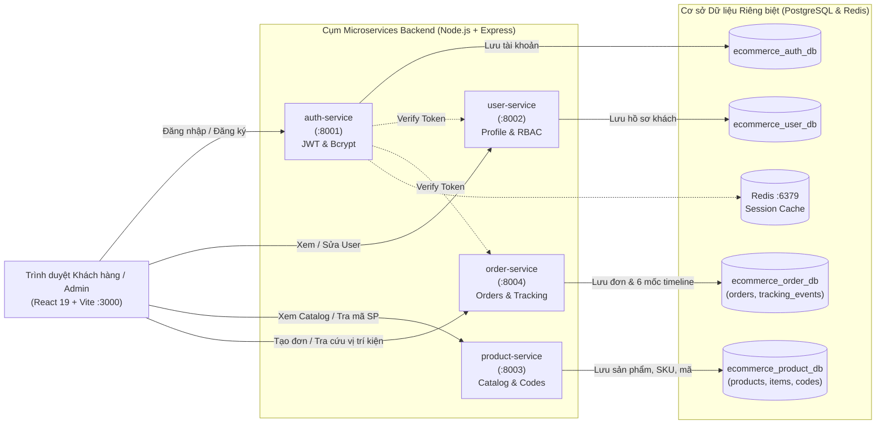

# SƠ ĐỒ TOÀN DIỆN LUỒNG HỆ THỐNG & LỘ TRÌNH PHÁT TRIỂN TIẾP THEO

> **Dự án**: OmniOrder - Hệ thống Bán hàng & Đơn hàng Order Trung Quốc (Microservices Architecture)  
> **Thời gian cập nhật**: 25/09/2026  
> **Repository**: [monnguyenx/ecommerce](https://github.com/monnguyenx/ecommerce)

---

## 1. SƠ ĐỒ LUỒNG NGHIỆP VỤ BÁN HÀNG ORDER TRUNG QUỐC (7 - 14 NGÀY)

Quy trình vận hành từ lúc khách hàng tìm kiếm sản phẩm cho đến khi nhận hàng và thanh toán nốt 50% tiền còn lại:

```mermaid
flowchart TD
    subgraph GiaiDoan1["1. Khám phá & Đặt cọc (Khách hàng)"]
        A["Khách tìm kiếm sản phẩm\n(Tên, Mã SP: SP-..., SKU, Barcode)"] --> B["Xem chi tiết sản phẩm\n& Chọn biến thể SKU"]
        B --> C["Xem chính sách Order Trung Quốc:\nGiá niêm yết, Cọc 50%, Về sau 7-14 ngày"]
        C --> D["Bấm 'Đặt hàng ngay'\nNhập thông tin người nhận"]
        D --> E["Tạo đơn hàng Order\n(Trạng thái: processing, Đã cọc 50%)"]
    end

    subgraph GiaiDoan2["2. Điều phối & Mua hàng (Admin / Manager)"]
        E --> F["Admin nhận đơn trên hệ thống\nKiểm tra nguồn hàng: Taobao / 1688 / Tmall"]
        F --> G["Lên đơn đặt hãng tại Trung Quốc\n(Cập nhật Trạm 1: Đã cọc & lên đơn)"]
        G --> H["Shop Trung Quốc phát hàng nội địa\n(Cập nhật Trạm 2 + Mã SF Express: SF...)"]
    end

    subgraph GiaiDoan3["3. Vận chuyển Xuyên Biên Giới (Logistics Hub)"]
        H --> I["Kho Quảng Châu / Đông Hưng nhận kiện\n(Cập nhật Trạm 3: Kho trung chuyển)"]
        I --> J["Xe container kéo về Cửa khẩu Hữu Nghị / Móng Cái\n(Cập nhật Trạm 4: Đang làm thủ tục thông quan)"]
        J --> K["Hải quan duyệt thông quan\nXe chuyển hàng về Kho phân loại VN (HN SOC / HCM)"]
        K --> L["Kho VN phân loại & dán tem bưu chính\n(Cập nhật Trạm 5 + Mã vận đơn VN: VNPost / GHN)"]
    end

    subgraph GiaiDoan4["4. Giao hàng chặng cuối & Thu COD 50%"]
        L --> M["Shipper giao hàng tận nhà khách\n(Cập nhật Trạm 6: Đang phát hàng)"]
        M --> N["Khách đồng kiểm kiện hàng\nThanh toán 50% tiền COD còn lại"]
        N --> O["Đơn hàng hoàn tất thành công\n(Trạng thái: completed)"]
    end

    style GiaiDoan1 fill:#0f172a,stroke:#3b82f6,stroke-width:2px,color:#fff
    style GiaiDoan2 fill:#0f172a,stroke:#8b5cf6,stroke-width:2px,color:#fff
    style GiaiDoan3 fill:#0f172a,stroke:#eab308,stroke-width:2px,color:#fff
    style GiaiDoan4 fill:#0f172a,stroke:#10b981,stroke-width:2px,color:#fff
```

---

## 2. SƠ ĐỒ LUỒNG DỮ LIỆU GIỮA CÁC MICROSERVICES

Kiến trúc độc lập cơ sở dữ liệu (`Database-per-Service`), giao tiếp thông qua RESTful API và JWT Header:

---

## 3. BẢNG TỔNG HỢP HIỆN TRẠNG (ĐÃ HOÀN THÀNH 100%)

| Thành phần | Nghiệp vụ đã hoàn thiện | Trạng thái kỹ thuật |
| :--- | :--- | :--- |
| **`product-service` (:8003)** | - Quản lý sản phẩm gốc, danh mục, thương hiệu. - Quản lý biến thể mặt hàng (`product_items` SKU, giá, tồn kho). - Bảng đa mã định danh (`product_codes` gồm mã SP, SKU, Barcode, QR). - API tra cứu đa năng: tìm theo bất kỳ mã nào đều trả về sản phẩm. | ✅ Đã kết nối DB PostgreSQL, API CRUD đầy đủ. |
| **`order-service` (:8004)** | - Quản lý đơn hàng đặt trước (China Pre-order 7-14 ngày). - Tự động chia tiền: **Cọc 50%** kích hoạt đơn + **Thu COD 50%** khi giao. - Quản lý 6 mốc tracking địa lý xuyên biên giới. - **Admin Console**: Chỉnh sửa trạm (1-6), vị trí kho, ghi chú, mã SF Express, mã VNPost, sửa mốc và thêm sự kiện phát sinh. | ✅ Đã kết nối DB PostgreSQL, hỗ trợ realtime timeline. |
| **`user-service` (:8002)** | - Quản lý người dùng, phân quyền RBAC (`customer`, `manager`, `admin`). - Thống kê đơn hàng và tổng chi tiêu của từng tài khoản. | ✅ Đã chạy cổng :8002, có bộ lọc phân quyền. |
| **`auth-service` (:8001)** | - Định danh, băm mật khẩu Bcrypt, cấp phát JWT access token. - Endpoint xác thực token (`/verify`) dành cho các dịch vụ khác. | ✅ Đã chạy cổng :8001. |
| **`frontend` (:3000)** | - Màn hình ô vuông Catalog + Slide trình chiếu Carousel. - Màn hình chi tiết sản phẩm chuyên biệt (chọn SKU, tính cọc). - Màn hình theo dõi hành trình đơn hàng kèm sóng radar xung kích. - Typography chuẩn tiếng Việt: `Be Vietnam Pro` + `Plus Jakarta Sans` + `JetBrains Mono`. - Animation Apple curve mượt mà trên tất cả các màn hình. | ✅ Đã test build sạch 0 lỗi, push GitHub `main`. |

---

## 4. GỢI Ý LỰA CHỌN CÁC BƯỚC TIẾP THEO (BẠN NÊN LÀM GÌ TIẾP THEO?)

Dưới đây là 5 hướng mở rộng nghiệp vụ thực tế nhất cho mô hình Order hàng Trung Quốc, sắp xếp theo mức độ ưu tiên và giá trị nghiệp vụ:

### 🌟 Lựa chọn 1 (Khuyên dùng nhất): Tích hợp Thanh toán Tự động & Quét mã QR VietQR Cọc 50%
- **Vấn đề hiện tại**: Đơn hàng tạo xong đang mô phỏng "đã nhận cọc 50%". Khách hàng ngoài đời thực cần phải chuyển khoản hoặc quét mã QR ngân hàng.
- **Tính năng triển khai**:
  1. Khi khách bấm *"Đặt hàng ngay"*, hệ thống sinh ra một **mã VietQR động** (kèm số tài khoản ngân hàng, đúng số tiền cọc 50%, nội dung chuyển khoản là mã đơn hàng `ORD-CN-...`).
  2. Tích hợp webhook nhận thông báo thanh toán (SePay / Casso / VietQR IPN): Khi khách chuyển khoản thành công, hệ thống tự động xác nhận đã cọc và đẩy đơn hàng sang Trạm 1 ngay lập tức mà không cần nhân viên check tài khoản thủ công.

### 🌟 Lựa chọn 2: Tính năng Dán link sản phẩm Taobao / 1688 tự động bóc tách (URL Paste & Price Converter)
- **Vấn đề hiện tại**: Admin phải nhập sản phẩm thủ công vào database. Khách mua hàng Trung Quốc thường có nhu cầu gửi một link Taobao/1688 bất kỳ để nhờ order.
- **Tính năng triển khai**:
  1. Thêm một ô nhập: *"Dán link sản phẩm Taobao / 1688 / Tmall vào đây"*.
  2. Bóc tách thông tin (Tiêu đề, ảnh sản phẩm, giá Nhân Dân Tệ ¥).
  3. Tự động quy đổi tỷ giá (Ví dụ: `1 CNY = 3.650 VND` + Phí dịch vụ mua hộ 3-5%) để ra giá tiền Việt và tiền đặt cọc 50% ngay lập tức.

### 🌟 Lựa chọn 3: Trung tâm Thông báo Tự động (Push Notifications & Zalo / Telegram Bot)
- **Vấn đề hiện tại**: Khách hàng chỉ biết trạng thái khi tự vào web xem.
- **Tính năng triển khai**:
  1. **Telegram Bot cho Admin**: Khi có khách đặt đơn mới hoặc chuyển khoản cọc thành công, bot bắn thông báo ngay vào nhóm Telegram của shop.
  2. **Thông báo cho Khách hàng**: Khi Admin cập nhật mốc *"Hàng đã về Kho Hà Nội"* hoặc *"Shipper đang giao"*, tự động gửi tin nhắn (hoặc thông báo chuông trên Web / Zalo ZNS) cho khách hàng chuẩn bị nhận hàng và chuẩn bị 50% tiền mặt COD.

### 🌟 Lựa chọn 4: Bảng Quản lý Tài chính, Biểu phí Vận chuyển & Cân nặng (Logistics Rate & Billing Engine)
- **Tính năng triển khai**:
  1. Quản lý tỷ giá Nhân Dân Tệ (CNY/VND) cập nhật theo ngày.
  2. Quản lý phí cân nặng (ví dụ: `25.000 đ/kg` với hàng thường, `35.000 đ/kg` với hàng điện tử).
  3. Khi hàng về kho Việt Nam, nhân viên chỉ cần cân kiện hàng (ví dụ: `1.8 kg`), hệ thống tự động cộng thêm phí vận chuyển quốc tế vào số tiền thu COD còn lại của khách.

### 🌟 Lựa chọn 5: Hoàn thiện API Gateway & Đóng gói Docker Compose Toàn cụm
- **Tính năng triển khai**:
  1. Sử dụng Nginx hoặc Node API Gateway gom tất cả về cổng 80/443 duy nhất (khách chỉ cần truy cập `localhost:80` hoặc domain thay vì phải nhớ port 8001, 8002, 8003, 8004).
  2. File `docker-compose.yml` hoàn chỉnh: Chạy đúng 1 lệnh `docker compose up -d` là dựng toàn bộ 4 backend microservices + 1 frontend + Postgres + Redis.
